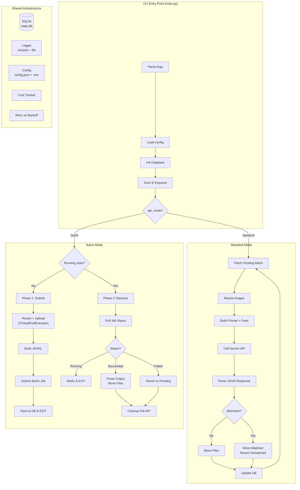
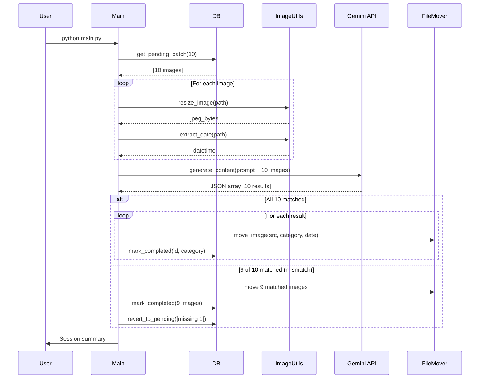
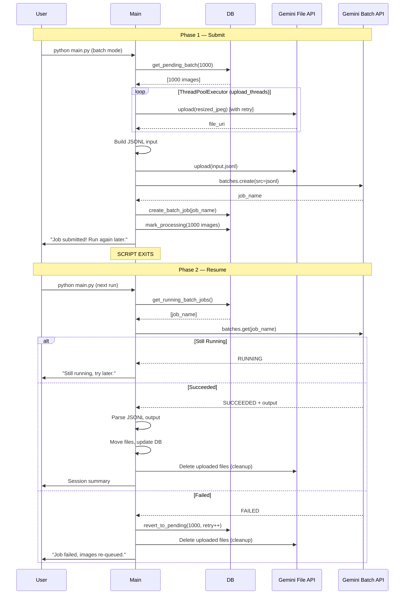
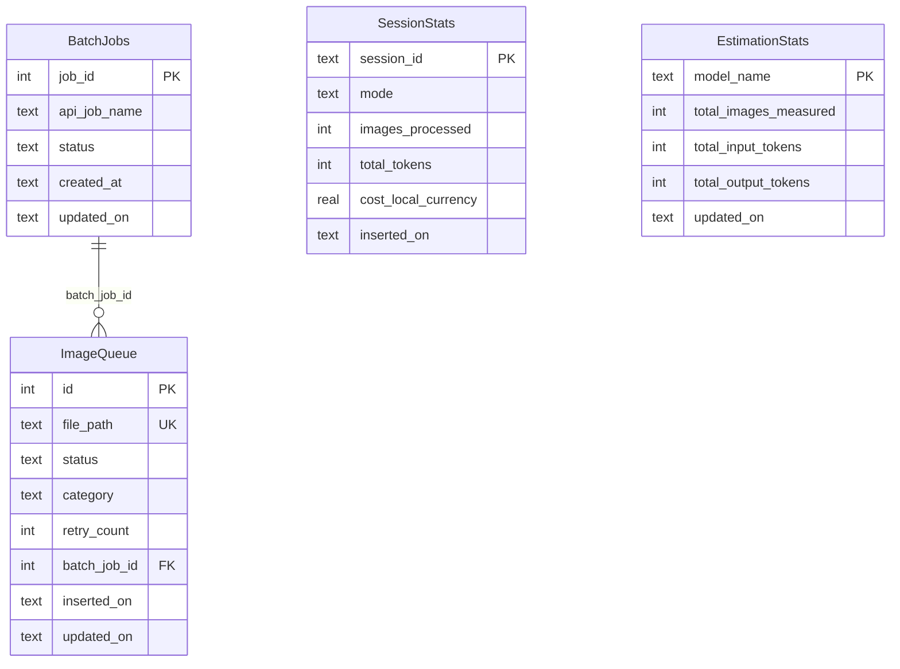

# Architecture

## System Overview

This diagram illustrates the high-level orchestration of the application. The `main.py` entry point handles environment initialization (config, database) and pre-calculates costs using self-calibrating historical data, before routing execution to either the Standard or Batch processing engine based on the `api_mode`. Both engines rely heavily on the Shared Infrastructure layer to ensure state is cleanly tracked and resuming is seamless.



## Standard Mode Sequence

Standard mode is synchronous and optimized for immediate results. To minimize API round-trips, it groups images into "clubs" (e.g., 10 images at once) and interleaves the image bytes directly into a single massive multimodal prompt. If the API successfully processes all 10 images, they are moved. If the AI hallucinates and returns fewer results (a mismatch), the missing images are gracefully reverted to `Pending` status in the database to be safely retried in the next batch.



## Batch Mode Lifecycle

Batch mode is fully asynchronous and significantly cheaper, designed for bulk processing. It operates in two lifecycle phases to allow the user to close the terminal while Google processes the data in the background.

**Phase 1** resizes and uploads images in parallel using `ThreadPoolExecutor` (configurable via `upload_threads`). Each upload is wrapped in `retry_with_backoff()` to handle rate limits. If the user presses Ctrl+C, all orphaned files are cleaned up from the File API before exiting. After uploads complete, the JSONL manifest is submitted.
**Phase 2** (triggered on a subsequent run of the script) polls the job status. When successful, it pulls the results, categorizes the files, and executes a parallel cleanup sweep of the File API to prevent exhausting the user's storage quota.



## Database Schema

The SQLite database (`state.db`) is the source of truth for the application's resilience. It uses WAL journal mode to support safe concurrent reads. 
- `ImageQueue` tracks the atomic state of every single file.
- `BatchJobs` manages the async lifecycle of Gemini API jobs.
- `SessionStats` aggregates historical run data for auditing.
- `EstimationStats` (not pictured) stores cumulative token usage per-model to self-calibrate future pre-run cost estimations.



## File Organization

```
whatsapp_images_sort/
├── main.py                  # CLI entry point & orchestrator
├── config.json              # User configuration
├── .env                     # API key (not committed)
├── state.db                 # SQLite state (auto-created)
├── src/
│   ├── config_manager.py    # Config loading + validation
│   ├── database.py          # SQLite CRUD operations
│   ├── image_utils.py       # Resize, date, EXIF
│   ├── prompt_builder.py    # Gemini prompt construction
│   ├── standard_mode.py     # Sync processing engine
│   ├── batch_mode.py        # Async processing engine (parallel uploads)
│   ├── file_mover.py        # Sorted directory management
│   ├── cost_tracker.py      # Token & cost accounting
│   ├── retry.py             # Exponential back-off retry utility
│   └── logger_setup.py      # Logging configuration
├── logs/                    # Per-run audit logs
├── error.log                # API error log (append)
├── tests/                   # pytest test suite
├── docs/                    # Documentation
└── prompt/                  # Project specification
```
