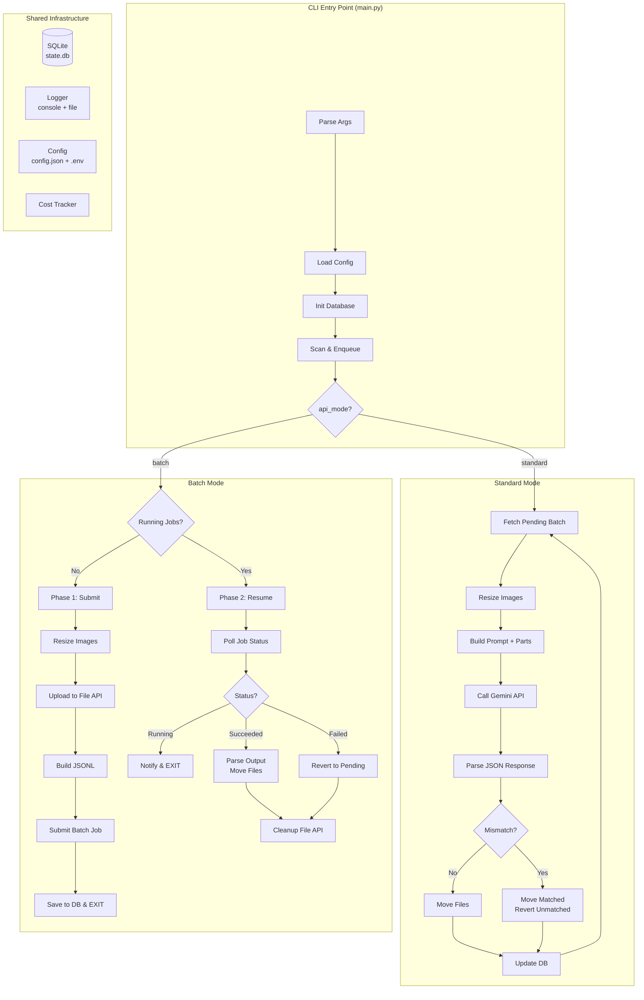
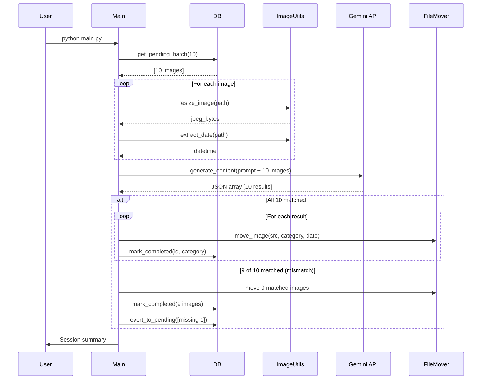
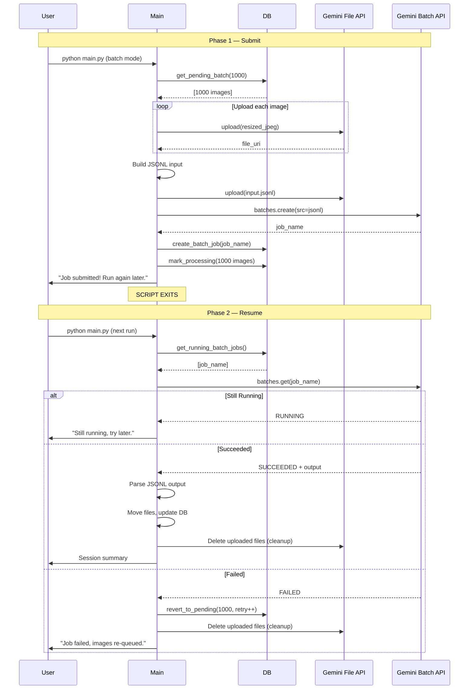
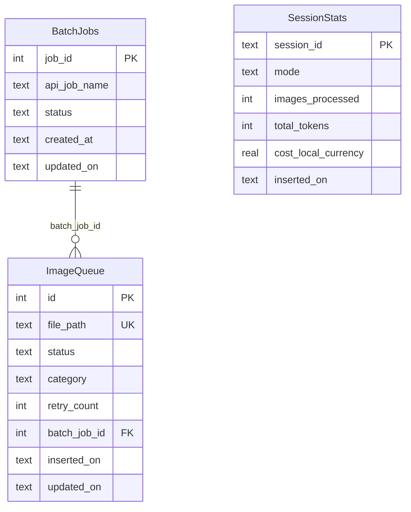

# Architecture

## System Overview

The WhatsApp Image Sorter is a config-driven CLI utility with two processing modes sharing a common infrastructure layer.



## Standard Mode Sequence



## Batch Mode Lifecycle



## Database Schema



## File Organization

```
whatsapp_images_sort/
├── main.py                  # CLI entry point & orchestrator
├── config.json              # User configuration
├── .env                     # API key (not committed)
├── state.db                 # SQLite state (auto-created)
├── src/
│   ├── config_manager.py    # Config loading + validation
│   ├── database.py          # SQLite CRUD operations
│   ├── image_utils.py       # Resize, date, EXIF
│   ├── prompt_builder.py    # Gemini prompt construction
│   ├── standard_mode.py     # Sync processing engine
│   ├── batch_mode.py        # Async processing engine
│   ├── file_mover.py        # Sorted directory management
│   ├── cost_tracker.py      # Token & cost accounting
│   └── logger_setup.py      # Logging configuration
├── logs/                    # Per-run audit logs
├── error.log                # API error log (append)
├── tests/                   # pytest test suite
├── docs/                    # Documentation
└── prompt/                  # Project specification
```
