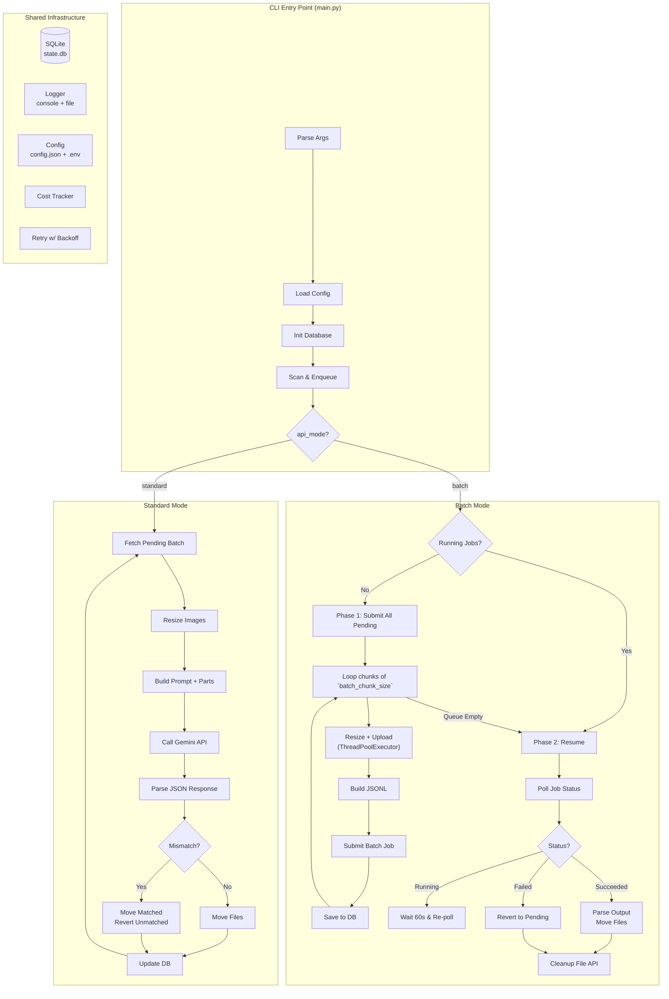
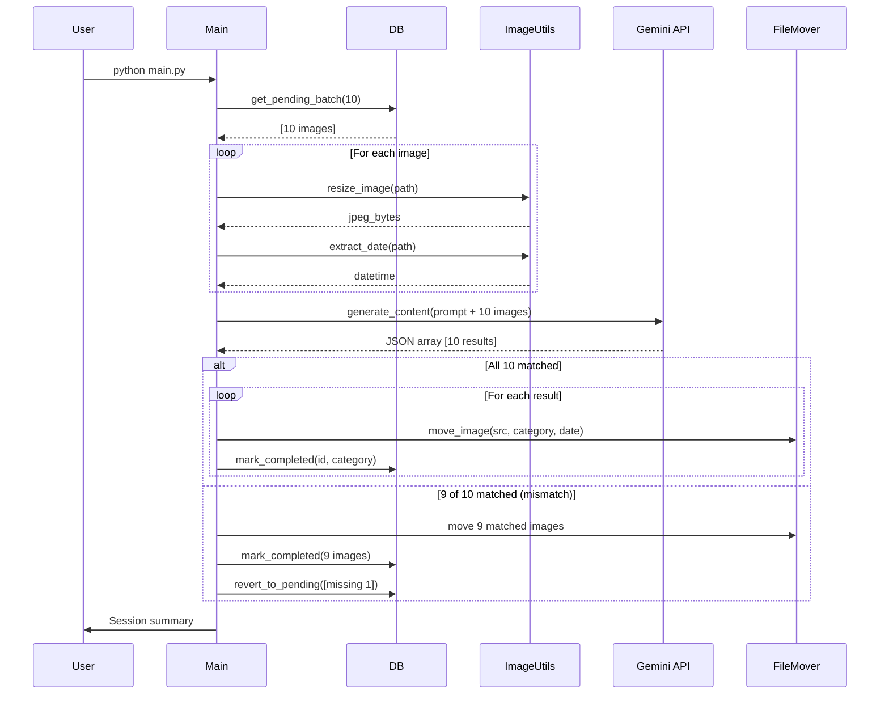
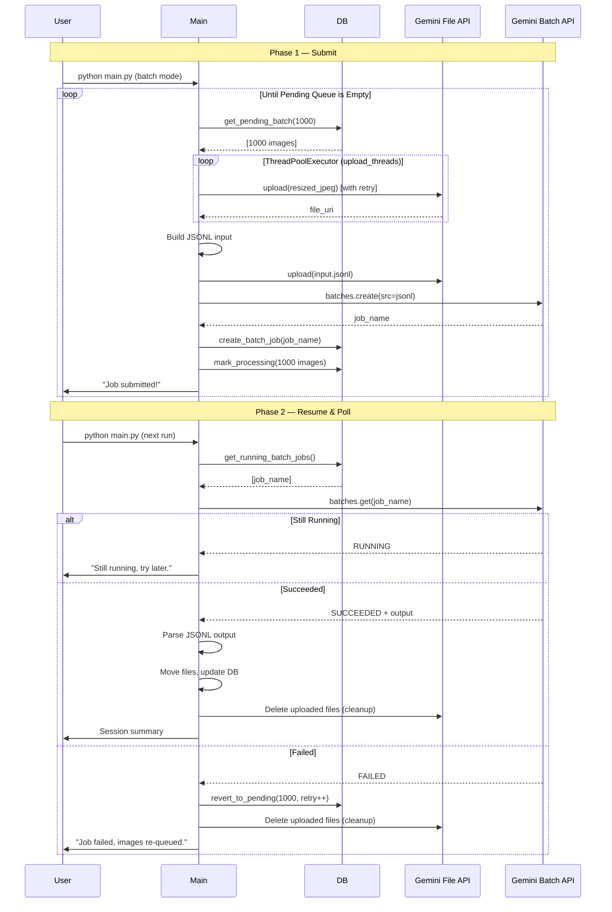
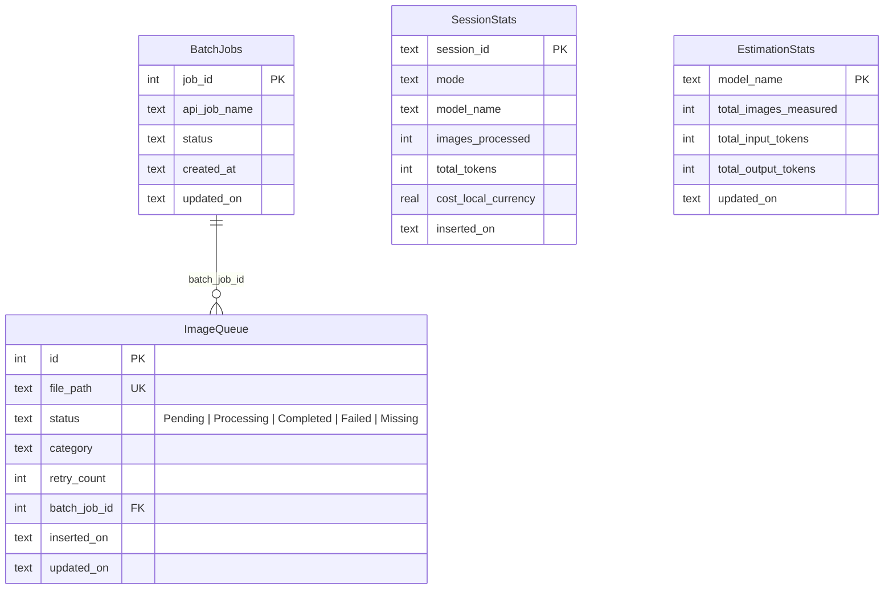

# Architecture

## System Overview

This diagram illustrates the high-level orchestration of the application. The `main.py` entry point handles environment initialization (config, database) and pre-calculates costs using self-calibrating historical data, before routing execution to either the Standard or Batch processing engine based on the `api_mode`. Both engines rely heavily on the Shared Infrastructure layer to ensure state is cleanly tracked and resuming is seamless.



## Standard Mode Sequence

Standard mode is synchronous and optimized for immediate results. To minimize API round-trips, it groups images into "clubs" (e.g., 250 images at once) and interleaves the image bytes directly into a single massive multimodal prompt. 

During the actual API call, it encapsulates the sync request inside a daemonized `threading.Thread`. This allows the script to draw an indeterminate `tqdm` UI spinner while waiting, and ensures `Ctrl+C` immediately abandons the request. If the AI hallucinates and returns fewer results (a mismatch), the missing images are gracefully reverted to `Pending` status in the database to be safely retried in the next batch.



## Batch Mode Lifecycle

Batch mode is fully asynchronous and significantly cheaper, designed for bulk processing. It automatically applies a 50% discount to all cost estimators. It operates in two lifecycle phases to allow the user to close the terminal while Google processes the data in the background.

**Phase 1** is executed *second* (only if no jobs are already running). It pulls chunks of images (up to `batch_chunk_size` at a time) from the pending queue and resizes/uploads them in parallel using a ThreadPoolExecutor. Each upload is wrapped in `retry_with_backoff()` to handle rate limits. The chunk is packaged into a JSONL manifest and submitted to the Batch API. This loop repeats until the *entire* pending queue has been successfully dispatched.
**Phase 2** is executed *first* on script launch. The script checks database job statuses. While jobs are running, it refuses to submit new batches, displaying a live countdown. When successful, it pulls the results, categorizes the files, and executes a parallel cleanup sweep of the File API to prevent exhausting the user's storage quota. If the user presses Ctrl+C at any point, all orphaned uploads are cleaned up from the File API before exiting.



## File Tracking & State Management

A core design principle of this project is that the **source directory is treated as strictly read-only**. 

When a batch completes successfully, the application does *not* actually "move" or delete the original files. Instead, `src/file_mover.py` **copies** the files to the output directory. This is why you will still see all original images in your source folder, while the destination folder only contains the processed ones. This non-destructive approach guarantees zero data loss if something goes wrong.

**How does the script know what has been processed?**
It does not rely on comparing the source and destination folders. Instead, it tracks the exact state of every single file using the SQLite Database (`state.db`).
1. **Scanning**: On startup, `main.py` scans the source directory. Next, it silently **auto-prunes** the database, deleting any previously stored table rows referring to images that no longer physically exist on disk (meaning the user manually deleted them while the tool was offline).
2. **Enqueuing**: It checks the DB. If an existing image path isn't in the DB, it inserts it with a `Pending` status.
3. **Processing**: When standard mode or batch mode successfully categorize an image and copy it to the destination, that specific row in the DB is updated to `Completed`. If the file was corrupted or unreadable, it is silently marked as `Missing`.
4. **Resuming**: The next time you run the script, `main.py` queries the database for files that are *still* `Pending`. It completely ignores files marked as `Completed` or `Missing`, which prevents duplicate processing and saves API costs.

## Database Schema

The SQLite database (`state.db`) is the source of truth for the application's resilience. It uses WAL journal mode to support safe concurrent reads. 
- `ImageQueue` tracks the atomic state of every single file.
- `BatchJobs` manages the async lifecycle of Gemini API jobs.
- `SessionStats` aggregates historical run data for auditing.
- `EstimationStats` (not pictured) stores cumulative token usage per-model to self-calibrate future pre-run cost estimations.



## File Organization

```
whatsapp_images_sort/
├── main.py                  # CLI entry point & orchestrator
├── config.json              # User configuration
├── .env                     # API key (not committed)
├── state.db                 # SQLite state (auto-created)
├── src/
│   ├── config_manager.py    # Config loading + validation
│   ├── database.py          # SQLite CRUD operations
│   ├── image_utils.py       # Resize, date, EXIF
│   ├── prompt_builder.py    # Gemini prompt construction
│   ├── standard_mode.py     # Sync processing engine
│   ├── batch_mode.py        # Async processing engine (parallel uploads)
│   ├── file_mover.py        # Sorted directory management
│   ├── cost_tracker.py      # Token & cost accounting
│   ├── retry.py             # Exponential back-off retry utility
│   └── logger_setup.py      # Logging configuration
├── logs/                    # Per-run audit logs
├── error.log                # API error log (append)
├── tests/                   # pytest test suite
├── docs/                    # Documentation
└── prompt/                  # Project specification
```
