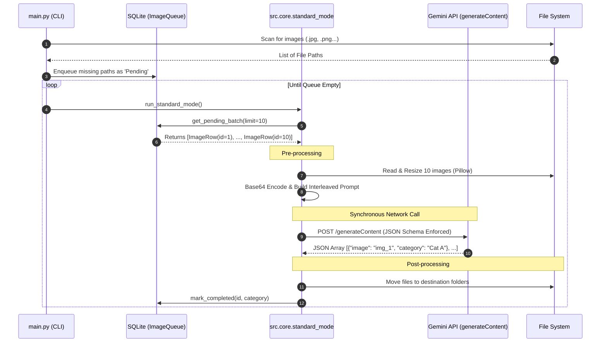
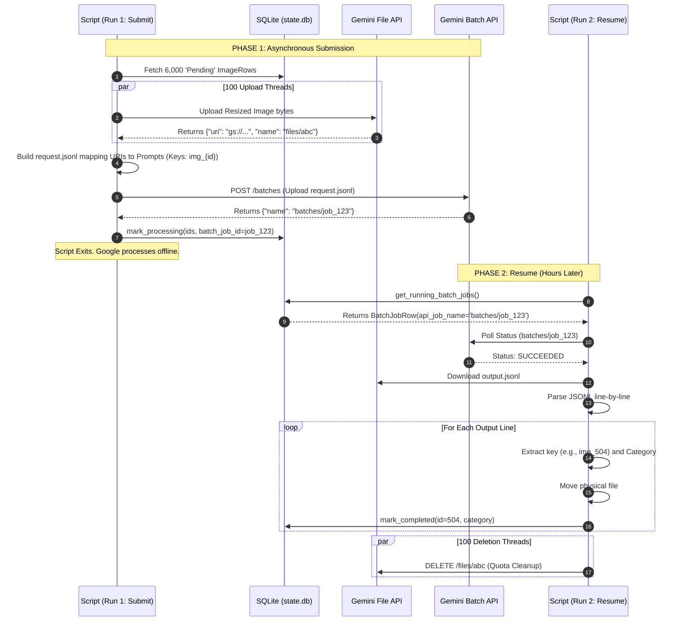

# Application Lifecycles & Data Flow

This application supports two distinct execution paths defined in `config.json`: **Standard Mode** and **Batch Mode**.

---

## Standard Mode (Synchronous API)

Ideal for smaller datasets (under 1,000 images) or real-time processing. It processes images sequentially in memory and waits for a direct response from Google GenAI.

### Flow Breakdown:
1. Fetch a "Club" (e.g., 10 images) from `state.db` where `status='Pending'`.
2. Resize all 10 images to 384x384 in memory using `Pillow`.
3. Construct a single interleaved prompt: `Image_1: <bytes> ... Image_10: <bytes>`.
4. Send the synchronous request. The main thread displays a live `tqdm` spinner while a background daemon thread waits for the network.
5. Parse the returned JSON array, move the physical files, and update `state.db` to `Completed`.

### Mermaid Sequence Diagram

---

## Batch Mode (Asynchronous API)

The recommended mode for large WhatsApp dumps (10,000+ images). It uses a "Submit, Exit, and Resume" architecture. It completely bypasses synchronous rate limits and leverages Google's server-side processing at a 50% discount.

### The ID Mapping Sync
To prevent race conditions, the script never relies on the order of files. When Thread 15 uploads a file, it tags it with `img_{row.id}`. The output `.jsonl` from Google will contain this exact key. The script loads the output, parses `img_504`, looks up ID `504` in the database, and moves the corresponding file.

### Flow Breakdown:
#### Phase 1 (Submission)
1. Fetch up to `batch_chunk_size` (e.g., 6,000) `Pending` images.
2. Spin up 100 concurrent threads (`ThreadPoolExecutor`).
3. Threads aggressively resize and upload images to the **Gemini File API**, gathering temporary `gs://` URIs.
4. Construct a massive `request.jsonl` file locally, pairing each `gs://` URI with the prompt template and `img_{id}` key.
5. Submit the JSONL to the **Gemini Batch API**. Mark all 6,000 images as `Processing` in the DB. The script exits.

#### Phase 2 (Resume & Cleanup)
1. Hours later, the user re-runs the script. `main.py` detects Batch mode and prioritizes Phase 2.
2. Fetch `Running` jobs from the `BatchJobs` table.
3. Poll the Gemini API. If `SUCCEEDED`, download the `output.jsonl` file.
4. Line-by-line, parse the JSON, extract the `img_{id}` key, move the file, and mark it `Completed`.
5. **Crucial:** Spin up 100 threads to aggressively `DELETE` the temporary images from the Gemini File API to free up the user's storage quota.

### Mermaid Sequence Diagram
